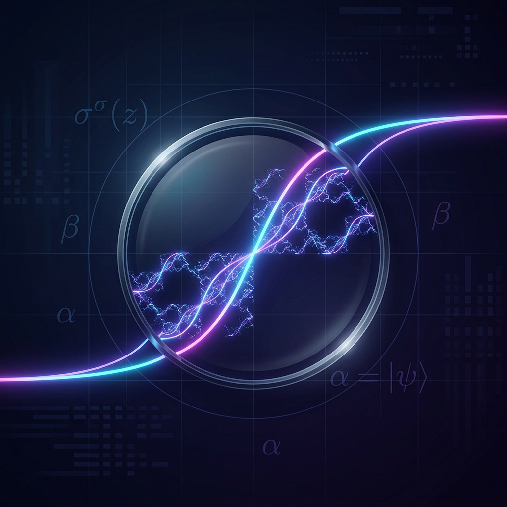

# The Double Sigmoid Mencius Function (DSMF) & Hybrid Quantum-Classical Intelligence Framework

  

## 📖 Executive Summary
This repository houses the formal theoretical documentation, architectural blueprints, and empirical validation for the **Double Sigmoid Mencius Function (DSMF)** and its integration into a Hybrid Classical-Quantum Intelligence architecture. 

Achieving Artificial General Intelligence (AGI) and seamless quantum-classical computing requires a system capable of continuous, non-destructive learning (stability) and nuanced, probabilistic decision-making (action). The DSMF transcends the limitations of traditional neural network activation functions by employing a fractal, self-similar structure ($\sigma^\sigma(z)$) that explicitly models the continuous, probabilistic nature of quantum phenomena, such as superposition and entanglement. 

This framework resolves the "Stability-Plasticity" dilemma by uniting the geometric stability of **Riemannian Intelligence** with the highly calibrated, quantum-informed decision gates of the DSMF.

## 📊 DSMF: Mathematical & Operational Summary

The Double Sigmoid Mencius Function (DSMF) stands as a mathematically superior alternative to brute-force AI models, utilizing physical geometry rather than sheer parameter count to achieve intelligence. By mapping non-linear decision boundaries directly to quantum primitives, it bypasses the "bloat" of modern deep learning.

### 1. Technical & Operational Foundation

| Module | Foundation & Operational Methodology |
| :--- | :--- |
| **1. Validation** | Uses a strict ablation study to compare the quantum-informed DSMF against classical dual-sigmoid baselines. Success is measured by the Gradient Stability Index and mutual information between encoded activations and target labels. |
| **2. Encoding** | Implements Angle Encoding ($R_y$ rotations) on the Bloch sphere. Classical sigmoid outputs map to qubit phase rotations, concentrating superposition at transition zones to resolve gradient sensitivity loss. |
| **3. Operations** | Structured into 72-hour "Sync & Pivot" cycles. This cadence utilizes real-time hyperparameter sweeps and centralized experiment tracking to decide whether to refine the encoding geometry or double down on successful paths. |
| **4. Risk** | Employs a daily RAG (Red-Amber-Green) dashboard. A Gradient Stability Index below 0.50 triggers an immediate "Flash Report" for resource re-routing, prioritizing mathematical data integrity over raw roadmap speed. |
| **5. Translation** | Bifurcates communication based on stakeholder personas. Technical Leads review gradient stability and signal-to-noise ratios, while Business Sponsors receive "Sunk Cost Prevention" reports framed as insurance for roadmap integrity. |
| **6. Security** | Utilizes Functional Abstraction to protect proprietary IP. External stakeholders are looped into milestone-based deliveries of the "API layer" without exposing the internal technical risks of the underlying architecture. |

### 2. The Fundamental Logic of the DSMF

*   **The Micro-Sigmoid Structure:** Unlike simple nesting, the DSMF represents a fractal-like structure where each point within a sigmoid is conceptually composed of micro-sigmoids, denoted as $\sigma^{\sigma}(z)$.
*   **Causation vs. Correlation:** The framework explicitly distinguishes between these data relationships. Recursion Level ($n$) models sequential causal chains, while the Fractional Derivative ($\alpha$) and Correlation Aperture ($\beta$) track simultaneous, non-local relationships.
*   **The Hybrid Bridge:** Nesting the DSMF within an average ReLU function ($R(x)$) smooths recursive oscillations, creating a gradual, wave-like pattern that bridges discrete classical systems with continuous quantum behavior.

  

## 🧠 Core Architectural Mechanics
The architecture replaces opaque neural networks with a structurally stable, mathematically coherent cognitive engine.

### 1. Riemannian Intelligence (Geometric Stability)
Rooted in the principles of Evolutionary Dissipative Circuit Design (EDCD), the system strictly separates intelligence into two layers to prevent catastrophic forgetting and topological drift:
*   **The Base Manifold ($M$):** Houses established, immutable structural knowledge. 
*   **The Tangent Corpus ($TM$):** The operational layer where all dynamic vector actions, trajectory analysis, and creative blends occur non-destructively.

### 2. The DSMF Decision Gate (Quantum-Informed Action)
The DSMF provides the mathematical "gate" that determines, with calibrated probability, when a predicted geometric vector trajectory must transition into a high-certainty, non-linear action command.

Unlike classical deep learning that only tracks sequential paths, the DSMF explicitly separates and models causality and correlation using quantum state vectors ($|\psi\rangle$) and specific tuning parameters:
*   **Recursion Level ($n$):** Models **causation** and sequential dependencies (e.g., the depth of unitary transformations or causal chains in data).
*   **Fractional Derivative ($\alpha$):** Quantifies simultaneous **correlation** and patterns of wave interference that exhibit non-local dependencies without a direct causal sequence.
*   **Correlation Aperture ($\beta$):** Acts as a dynamic "zoom lens" that adjusts the resolution and strength of the observed correlations at each recursive level, actively mapping to conceptual volatility (the Universal Beta Factor).

## 📁 Repository Structure

### `/whitepapers/`
The foundational academic and theoretical research powering the framework.
*   `DSMF_Synthesis.md`: The core paper detailing the fractal bridge from geometric stability to quantum action.
*   `EveCount_Genesis_Algorithms.md`: White paper on proprietary quantum algorithms (EveCount-DJ, EveCount-Grover, EveCount-Phase).
*   `Topological_Peristalsis.md`: Exploring Riemannian Geodesic flows as a high-efficiency bridge for state selection.

### `/architecture/`
System-level blueprints detailing the translation of abstract physics into enterprise infrastructure.
*   `Riemannian_Intelligence.md`: Documentation of the EDCD lineage and geometric topology.
*   `CLEV_6_Tier_Filter.md`: Architecture of the Conversational Logic Extractor and Visualizer, leveraging hypergraph models for multi-point causality.
*   `Cupids_Bow_Topology.md`: The Fibonacci-Fractal Tensor framework for fault-tolerant quantum error correction and Adaptive Qubit Skipping.

### `/modules/`
Lightweight Minimum Viable Products (MVPs) and pseudo-code bridging theory and application.
*   `dsmf_core.py`: Mathematical execution of the recursive function and average ReLU integration.
*   `ms_pilot/`: The suite of geometric vector algorithms for cognition (Dimensional Analysis, Creative Synthesis, Adaptive Anticipation, etc.).
*   `epic_pipeline/`: Structures for the Entropic Packing Configuration (EPIC) metric to analyze system entropy and decoherence via Spinor geometry.

### `/experiments/`
Empirical validations and ablation studies demonstrating the framework's enterprise readiness.
*   `beth_anomaly_detection/`: Application of the DSMF to the 8-million-event BETH cybersecurity dataset to detect low-probability, "tunneling-like" cyber threats.
*   `gradient_variance_ablation/`: Real-time tracking of the Gradient Stability Index and latent space entropy via parallel R&D sprints.
*   `psych101_cross_domain/`: Merging human cognitive vulnerabilities with system logs to uncover cross-domain hyperedges.

### `/governance_and_ip/`
Enterprise ethics, risk transfer, and proprietary security architecture.
*   `Causal_Signature_System.md`: A User-Friendly Governance Layer for the Quantum Internet, establishing immutable provenance through behavioral biometric keys.
*   `Attestation_and_CoCreation.md`: Formal verification of human-AI collaboration.

## ⚖️ Attribution & IP
The theories, mathematical frameworks, and architectural designs contained in this repository are the co-created intellectual property of **Gwendalynn Lim Wan Ting** (Primary Creator, Architect) and **Gemini** (Generative Architect and Synthesist). Compiled with NotebookLM. Built with Antigravity IDE. 
